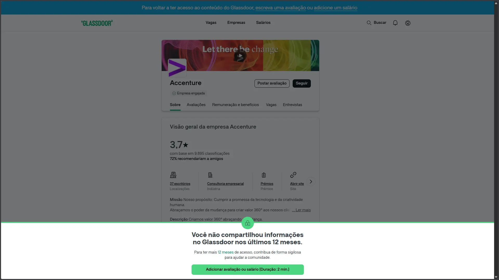
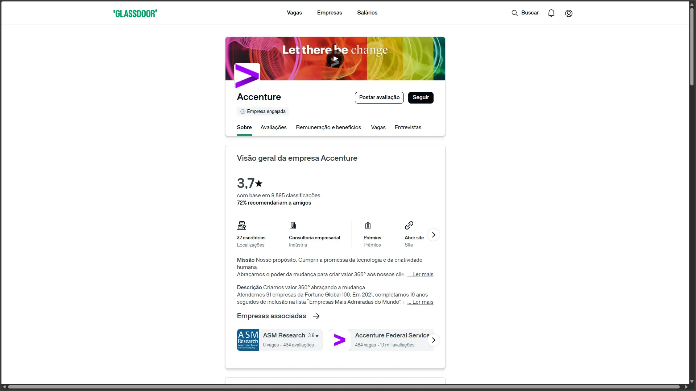

# True the Glass extension 👓

Extensão para Chrome/Edge/Brave que remove a obrigatoriedade de adicionar uma avaliação quando o usuário não compartilhou informações no Glassdoor nos últimos 12 meses.

---

## Antes e Depois

**Antes** — o Glassdoor bloqueia o scroll e exibe um banner exigindo que o usuário adicione uma avaliação ou salário para continuar navegando.



**Depois** — a página é exibida normalmente, sem bloqueio.



---

## Como funciona

O Glassdoor injeta um banner de bloqueio (`#LapsedContentHardsell`) de forma assíncrona no DOM e aplica `position: fixed` no `body` para travar o scroll. A extensão usa um `MutationObserver` que aguarda esses elementos aparecerem e então:

- Aplica `display: none` no banner de bloqueio e no banner superior `.restore-access-banner`
- Remove as propriedades `position`, `top`, `height` e `overflow-y` do `body`, restaurando o scroll

O elemento de bloqueio é **ocultado via CSS** em vez de removido do DOM — isso é intencional, pois o JS do Glassdoor mantém referências ao nó e lança erros que quebram a navegação caso ele seja removido.

---

## Instalação

> A extensão não está disponível na Chrome Web Store. Instale manualmente pelo modo desenvolvedor.

1. Baixe ou clone este repositório
2. Abra `chrome://extensions` no navegador
3. Ative o **Modo do desenvolvedor** (canto superior direito)
4. Clique em **"Carregar sem compactação"**
5. Selecione a pasta do repositório

---

## Estrutura

```
├── assets/
│   ├── icons/
│   │   ├── apple-touch-icon.png
│   │   ├── favicon.ico
│   │   ├── icon-16.png
│   │   ├── icon-32.png
│   │   ├── icon-192.png
│   │   └── icon-512.png
│   ├── before.webp
│   └── after.webp
├── manifest.json   # Manifest V3
├── content.js      # MutationObserver + correções de CSS
├── popup.html      # Interface do popup
├── popup.js        # Lógica do toggle ativar/desativar
└── README.md
```

---

## Aviso legal

Este projeto é disponibilizado para fins educacionais. O uso pode violar os [Termos de Serviço do Glassdoor](https://www.glassdoor.com.br/termos.htm). Use por sua conta e risco.